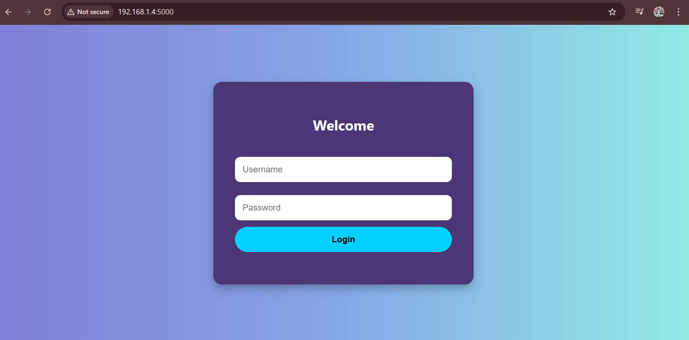
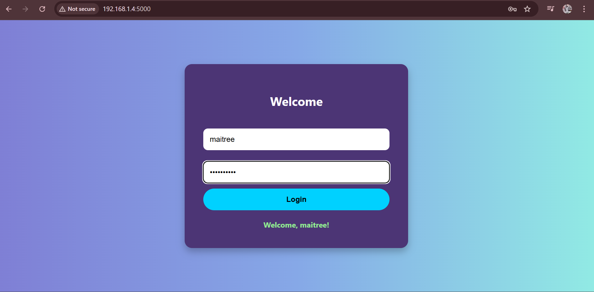
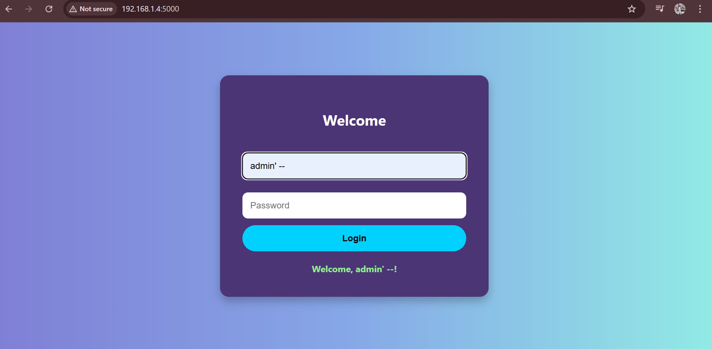
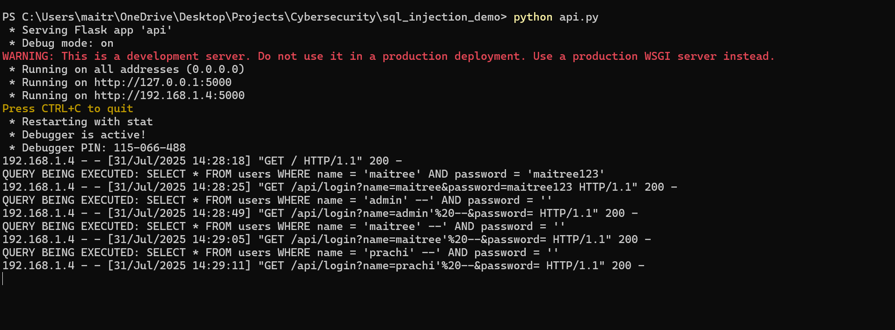

# 💉 SQL Injection Demo (Modified Version With Custom Users)

This is a modified version of [vivek3141's SQL Injection Demo](https://github.com/vivek3141/sql-injection-demo).  
I modified the frontend and backend for learning purposes, including custom users like `maitree` and `prachi`.

## 👤 Original Project Credits

🔗 Original Author: [Vivek Verma](https://github.com/vivek3141)  
📂 Original Repo: [https://github.com/vivek3141/sql-injection-demo](https://github.com/vivek3141/sql-injection-demo)

## 🔧 Changes Made
- Added custom users (e.g., `maitree`, `prachi`)
- Modified HTML frontend
- Adjusted login logic for demo purposes

## 📝 License

This project remains under the MIT License, as per the original repository.

## 📸 Screenshots

🔐 Login Page (Custom UI)


✅ Successful Login (Example)


💥 SQL Injection Bypass Example


🧾 Terminal Output (Query Being Executed)


## 🚀 How to Run

```bash
# Clone the repo
git clone https://github.com/maitreesharmaa/sql-injection-demo-custom.git
cd sql-injection-demo-custom

# Install dependencies
pip install flask

# Run the application
python api.py

Visit http://127.0.0.1:5000 in your browser.

